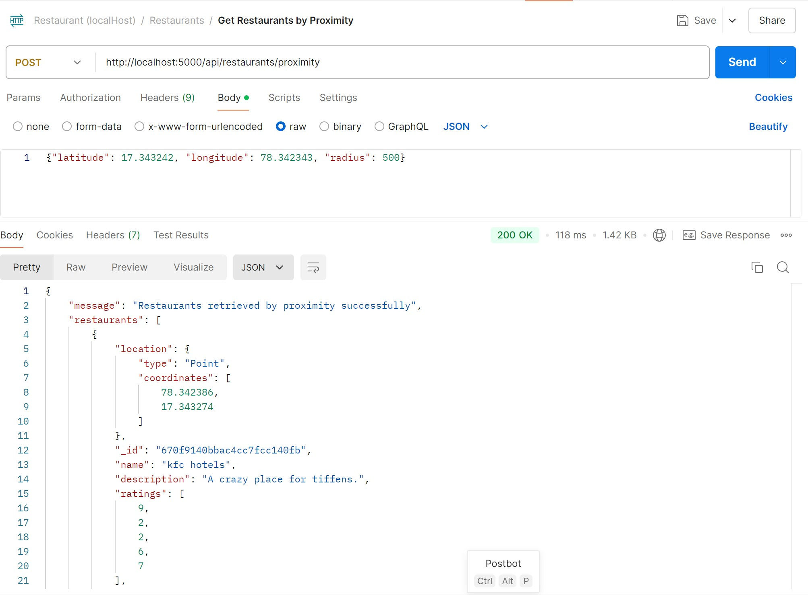
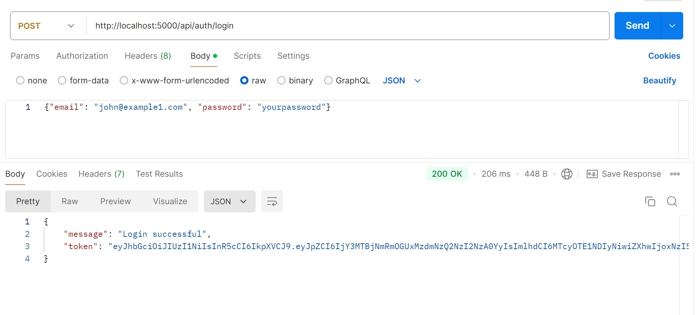

# Installation


1. Clone the repository:
   ```bash
   git clone https://github.com/your-username/restaurant-api.git
   cd restaurant-api
Install the dependencies:

```

npm install
```
Set up the environment variables in a .env file (see the next section for details).

Run the application:

```

npm start
```
Environment Variables
Create a .env file in the root directory with the following environment variables:

makefile

*  MONGO_URI=mongodb+srv://<username>:<password>@cluster0.mongodb.net/your-db?retryWrites=true&w=majority
JWT_SECRET=your_jwt_secret
PORT=5000

 *  MONGO_URI: Your MongoDB Atlas connection string
*  JWT_SECRET: Secret key used for signing JWT tokens
PORT: The port where the server will run (default: 5000)
csharp

You can copy and paste this directly into your `README.md` file.


## Project Structure


## API Endpoints

### Authentication 🔐

| Method | Endpoint            | Description                       |
|--------|---------------------|-----------------------------------|
| POST   | /api/auth/register  | Register a new user 📝           |
| POST   | /api/auth/login     | Log in and get a JWT token  🔑   |

### Restaurant Operations

| Method | Endpoint                 | Description                               |
|--------|--------------------------|-------------------------------------------|
| POST   | /api/restaurants         | Create a new restaurant (protected) ➕   |
| GET    | /api/restaurants         | Get a list of all restaurants     📋     |
| PUT    | /api/restaurants/:id     | Update a restaurant by ID (protected) ✏️ |
| DELETE | /api/restaurants/:id     | Delete a restaurant by ID (protected) 🗑️  |


## Geolocation-based Queries 🌍

| Method | Endpoint            | Description                                                        |
|--------|---------------------|--------------------------------------------------------------------|
| POST   | /api/range          | Retrieves restaurants within a specific distance range  📍         |
| POST   | /api/proximity      | A list of restaurants within the specified radius  📏              |

### Get Restaurants Within a Distance Range 📏


- **Endpoint:** `/api/restaurants/range`
- **Method:** `POST`
- **Description:** Retrieves restaurants within a specific distance range from a given latitude and longitude.

**Input:**
```json
{
  "latitude": 17.343242,
  "longitude": 78.342343,
  "minimumDistance": 500,
  "maximumDistance": 2000
}
```
* latitude: The latitude of the user's current location.
* longitude: The longitude of the user's current location.
* minimumDistance: Minimum distance in meters.
* maximumDistance: Maximum distance in meters.
### Output:

```
{
  "message": "Restaurants retrieved successfully",
  "restaurants": [
    {
      "name": "Restaurant B",
      "description": "A great spot for brunch.",
      "location": {
        "latitude": 17.345565,
        "longitude": 78.348900
      },
      "averageRating": 4.8,
      "noOfRatings": 10
    }
  ]
}
```


### Get Restaurants by Proximity 📍(Radius)

- **Endpoint:** `/api/restaurants/proximity`
- **Method:** `POST`
- **Description:** A list of restaurants within the specified radius, sorted from nearest to farthest..

**Input:**
```json
{
"latitude": 17.343242,
"longitude": 78.342343,
 "radius": 500
}
```
* latitude: The latitude of the user's current location.
* longitude: The longitude of the user's current location.
* Radius: The maximum distance (radius) in meters within which to find restaurants.

### Output:

```
{
    "message": "Restaurants retrieved by proximity successfully",
    "restaurants": [
        {
            "location": {
                "type": "Point",
                "coordinates": [
                    78.342386,
                    17.343274
                ]
            },
            "_id": "670f9140bbac4cc7fcc140fb",
            "name": "kfc hotels",
            "description": "A crazy place for tiffens.",
            "ratings": [
                9,
                2,
                2,
                6,
                7
            ],
            "__v": 0
        },
```



# Example Requests with Postman 📮

## 1. Register a User
* Method: POST
* URL: http://localhost:5000/api/auth/register
* Body: (JSON)

```
{
  "name": "John Doe",
  "email": "john@example.com",
  "password": "password123"
}
```
### Response


## 2.Log In a user
* Method: POST
* URL: http://localhost:5000/api/auth/login
* Body: (JSON)

```
{
  "email": "john@example.com",
  "password": "password123"
}
```
### Response



## 3. Create a Restaurant (Protected Route)
* Method: POST
* URL: http://localhost:5000/api/restaurants

```
Headers:  Authorization: Bearer <your-jwt-token>
```

``` 
* Body:

{
  "name": "New Restaurant",
  "description": "A great place to eat.",
  "location": {
    "type": "Point",
    "coordinates": [78.343242, 17.343242]
  }
}

```
### Response


## 4. Get list of all Restaurant (Protected Route)
* Method: Get
* URL: http://localhost:5000/api/restaurants

```
Headers:  Authorization: Bearer <your-jwt-token>
```

``` 
### Response


## 5. Update a Restaurant (Protected Route)
* Method: put
* URL: http://localhost:5000/api/restaurants/:id 

```
Headers:  Authorization: Bearer <your-jwt-token>
```

``` 
* Body:

{
  "name": "updated New Restaurant",
  "description": "A great place to eat.",
  "location": {
    "type": "Point",
    "coordinates": [78.343242, 17.343242]
  }
}

```
### Response


### 6. Delate Restaurant (Protected Route)
* Method: delate
* URL: http://localhost:5000/api/restaurants/:id

```
Headers:  Authorization: Bearer <your-jwt-token>
```

``` 
### Response


### 7.Find Restaurants Within a Range
* Method: POST
* URL: http://localhost:5000/api/restaurants/range
* Body: (JSON)

```

{
  "latitude": 17.343242,
  "longitude": 78.342343,
  "minimumDistance": 500,
  "maximumDistance": 2000
}

```

```
### Response

json
Copy code
{
  "message": "Restaurants retrieved successfully",
  "restaurants": [
    {
      "name": "Restaurant B",
      "description": "A great spot for brunch.",
      "location": {
        "latitude": 17.345565,
        "longitude": 78.348900
      },
      "averageRating": 4.8,
      "noOfRatings": 10
    }
  ]
}
```


### 8.Get Restaurants Within a Distance Range

- **Endpoint:** `/api/restaurants/range`
- **Method:** `POST`
- **Description:** Retrieves restaurants within a specific distance range from a given latitude and longitude.

**Input:**
```json
{
  "latitude": 17.343242,
  "longitude": 78.342343,
  "minimumDistance": 500,
  "maximumDistance": 2000
}
```
* latitude: The latitude of the user's current location.
* longitude: The longitude of the user's current location.
* minimumDistance: Minimum distance in meters.
* maximumDistance: Maximum distance in meters.
### Output:

```
{
  "message": "Restaurants retrieved successfully",
  "restaurants": [
    {
      "name": "Restaurant B",
      "description": "A great spot for brunch.",
      "location": {
        "latitude": 17.345565,
        "longitude": 78.348900
      },
      "averageRating": 4.8,
      "noOfRatings": 10
    }
  ]
}
```


### Error Handling:

* 400 Bad Request: Returned when required fields are missing or invalid.
* 401 Unauthorized: Returned when the JWT token is missing or invalid.
* 404 Not Found: Returned when no restaurants are found within the specified range.
* 500 Internal Server Error: Returned when an unexpected server error occurs.

License
This project is licensed under the MIT License.

